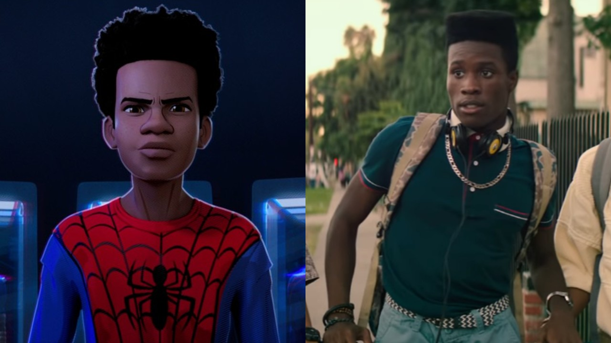

# Allison Dolan
My favorite movie is Spiderman Across the Spider-verse and I think it is a work of art. Every frame is made to be perfect and very stylistic. They literally changed the amount of frames per second they animated the main character to portray that he was one step behind the rest of them until he had his moment and grew into being spiderman. The use of color to potray emotion and certain scenes is also crazy and so amazing to me.

## Who Else Could Have Been Miles?
### | Name | Reason | Age |
| --- | --- | --- |
| Nadji Jeter | He voices the PS5 game of it | 28 |
| Jharrel Jerome | He did the variant of Miles in the movie | 27 |
| Rhenzy Feliz | Worked on multiple Marvel projects and speaks spanish and Miles is multicultural| 27 |
| Donald Glover | Previous voice actor of Miles in 2014 | 41 |
